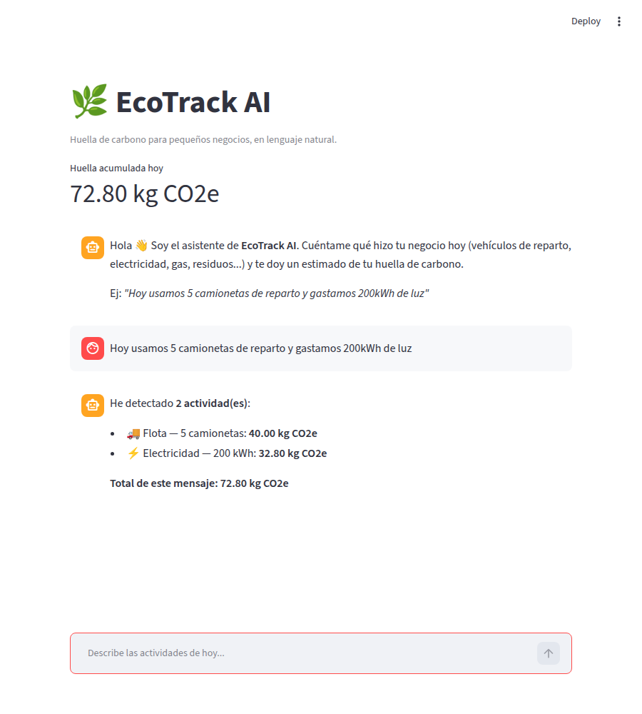
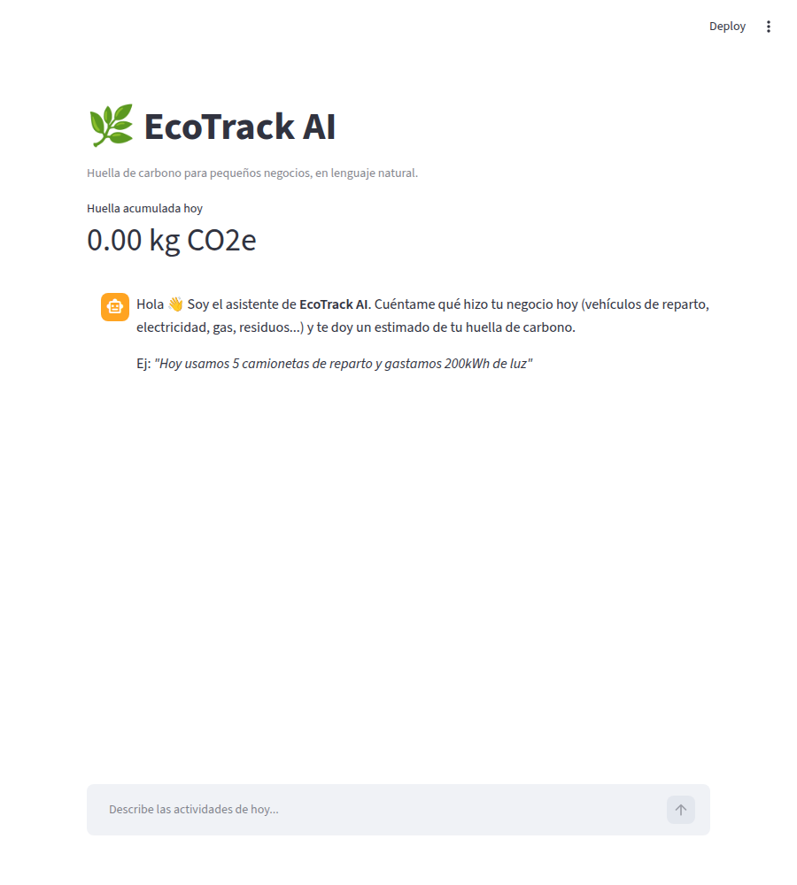
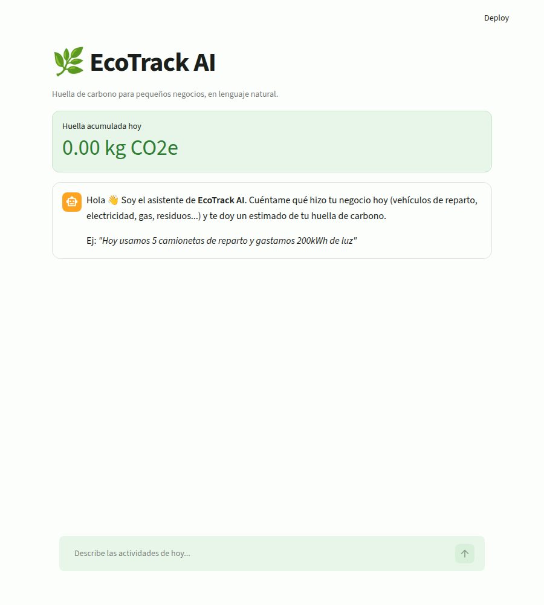
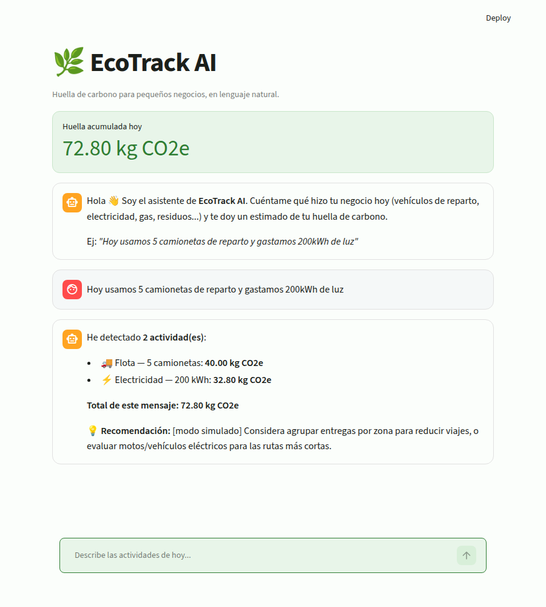
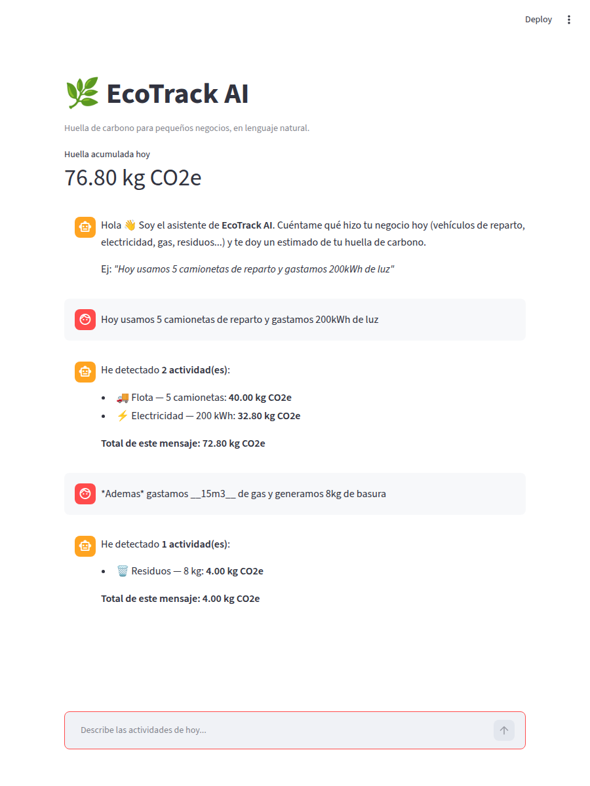
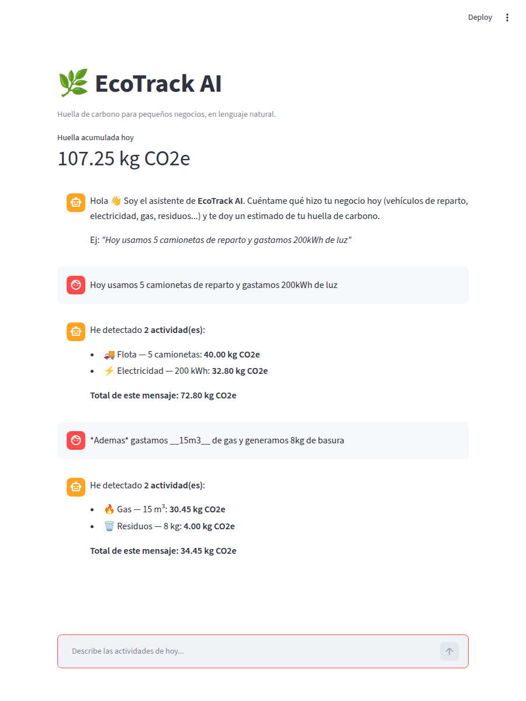

# Bitácora — EcoTrack AI (Capstone Vibe Coding)

## 1. El "vibe" y el prompt maestro

Antes de escribir código, se definió el prompt maestro con la visión técnica
y estética completa del proyecto (stack, interfaz de chat, alcance de la
función de IA, reglas de comportamiento del agente). Ver
[`master_prompt.md`](./master_prompt.md) para el texto completo.

Decisiones clave que salieron de ese prompt:

- Interfaz de **chat** (`st.chat_input` / `st.chat_message`) en vez de un
  formulario, porque el enunciado explícitamente pide algo que un dueño de
  negocio pueda usar como si le escribiera a alguien por WhatsApp.
- Una función `extraer_actividades_ia()` con la misma forma que tendría una
  llamada real a un LLM (mismo contrato de entrada/salida), aunque para este
  MVP se implementó **simulada** (heurísticas + regex) — decisión tomada
  explícitamente para no depender de una API key en el despliegue de
  evaluación, sin sacrificar la posibilidad de conectar una API real después.

## 2. Desarrollo iterativo

### v1 — Funcionalidad primero

Se construyó `app.py` + `ai_extractor.py` con el estilo por defecto de
Streamlit, para validar la lógica antes de invertir en diseño.

Prueba con la frase exacta del enunciado
*("Hoy usamos 5 camionetas de reparto y gastamos 200kWh de luz")*:

Resultado: 5 camionetas (40.00 kg CO2e) + 200 kWh (32.80 kg CO2e) =
**72.80 kg CO2e**, calculado correctamente.

### Iteración de diseño — "Hazlo más minimalista y usa tonos verdes"

Instrucción dada en lenguaje natural al agente, tal como sugiere el
enunciado. El agente respondió con dos cambios concretos:

1. `.streamlit/config.toml` — tema nativo de Streamlit con paleta verde
   (`primaryColor = "#2E7D32"`, fondo `#FBFEFB`, fondo secundario `#E8F5E9`).
2. CSS inyectado en `app.py` — oculta el menú/footer por defecto, redondea
   las tarjetas del chat, y resalta el métrico de huella acumulada con un
   recuadro verde suave.

Antes / después:

| Antes (v1) | Después (v2, minimalista + verde) |
|---|---|
|  |  |

## 3. Funcionalidad de IA implementada

EcoTrack AI tiene dos capas de IA distintas, con propósitos distintos:

### 3.1 Extracción de actividades (simulada a propósito)

`ai_extractor.extraer_actividades_ia(texto)` recibe el mensaje libre del
usuario y devuelve una lista estructurada de actividades detectadas (tipo,
detalle, cantidad, unidad, CO2 estimado), cubriendo cuatro categorías de
consumo de negocio: flota de vehículos, electricidad (kWh), gas (m³) y
residuos (kg).

Es una **simulación documentada**: en vez de una llamada a un modelo de
lenguaje, usa palabras clave + expresiones regulares. Se decidió así para
que el MVP funcione sin necesidad de configurar una API key en el entorno
de despliegue de evaluación. El módulo expone el mismo contrato (texto de
entrada → lista de actividades de salida) que tendría una versión real
basada en un LLM, así que sustituirla es un cambio contenido a esta
función.

### 3.2 Recomendaciones personalizadas (real, con Claude)

`ai_recommendations.generar_recomendacion_ia(actividades, total)` sí hace
una **llamada real** a la API de Claude (`claude-sonnet-4-5`) cuando hay una
`ANTHROPIC_API_KEY` configurada: le pasa un resumen de las actividades
detectadas y el total de CO2, con un system prompt que la instruye a actuar
como asesor de sostenibilidad y devolver una recomendación breve y
específica (no genérica).

Si no hay key, o la llamada falla por cualquier motivo (red, cuota,
timeout), la función cae automáticamente a un recomendador simulado basado
en reglas (elige un tip según la categoría con mayor CO2 del día). Este
diseño con respaldo (`try/except` amplio alrededor de la llamada real) es
intencional: la app nunca debe romperse porque un servicio externo falle.

Captura del chat con la recomendación (modo simulado, sin key configurada
en este entorno de pruebas):

## 4. Debugging con IA

**Problema encontrado:** al probar una segunda actividad en la conversación
con formato de énfasis (`*Además* gastamos __15m3__ de gas...`), la app no
detectaba el gas, y el mensaje del usuario se renderizaba con cursiva/negrita
en vez de mostrar el texto tal cual se escribió.

Antes del fix:

**Diagnóstico:** se le pidió al agente reproducir el caso en aislado
(`extraer_actividades_ia()` directamente, sin la interfaz) para confirmar
que el problema estaba en el parser y no en Streamlit. Causa raíz: los
guiones bajos de markdown (`__15m3__`) quedaban pegados al número y a la
unidad, y el regex de gas esperaba solo espacios entre `"15m3"` y `"de gas"`,
así que no matcheaba. Un segundo síntoma relacionado: `st.markdown()`
interpretaba los asteriscos/guiones bajos del usuario como formato en vez de
texto literal.

**Solución (propuesta y aplicada por el agente, sin depurar línea a línea
manualmente):**

1. `_sanitizar()` en `ai_extractor.py` — quita `*`, `_` y `` ` `` del texto
   antes de aplicar cualquier patrón, en vez de parchar cada regex por
   separado.
2. `_escapar_markdown()` en `app.py` — escapa esos mismos caracteres antes de
   mostrar el mensaje del usuario, para que se vea tal como lo escribió.

Después del fix (misma frase, detecta gas y residuos, y el texto se muestra
literal):

## 5. Prompts por componente

El "Master Prompt" (sección 1) dio el contexto general una sola vez. Cada
componente se construyó luego con una instrucción puntual sobre esa base:

| Componente | Prompt (resumen fiel de la instrucción dada) |
|---|---|
| Frontend / interfaz de chat | "Quiero una interfaz de chat con `st.chat_input`/`st.chat_message`, no un formulario. Debe mostrar la huella acumulada del día arriba, e historial de la conversación." |
| Backend / parser de actividades | "Detecta vehículos (con cantidad), kWh, m³ de gas y kg de residuos en texto libre en español, con clave-valor de factores de emisión documentados. Si no detecta nada, no falles en silencio: dilo explícitamente." |
| Iteración de diseño | "Hazlo más minimalista y usa tonos verdes." (instrucción literal del enunciado, aplicada tal cual) |
| Debugging | "El gas no se está detectando en el segundo mensaje del chat, revisa por qué y corrígelo sin que yo tenga que depurar el regex a mano." |
| Función de recomendaciones IA | "Agrega una función que llame a la API de Claude para dar una recomendación personalizada según las actividades detectadas, con system prompt de asesor de sostenibilidad, y que si no hay API key o falla la llamada, caiga a un modo simulado sin romper el chat." |

Ninguno de estos prompts se acertó a la primera sin ajuste: por ejemplo, el
prompt del parser inicial no mencionaba "no falles en silencio" — se agregó
después de notar que un mensaje sin actividades reconocibles simplemente no
generaba respuesta, lo cual es una mala experiencia de chat.

## 6. Iteración basada en retroalimentación del evaluador

La primera entrega de este capstone recibió una calificación de 73/100. El
feedback pedía explícitamente dos cosas que se abordaron en esta segunda
iteración:

1. *"Documenta explícitamente cómo utilizaste las herramientas de IA...
   comparte ejemplos de prompts para componentes específicos"* → sección 5
   de esta bitácora.
2. *"El proyecto tiene potencial para profundizar en el uso de la IA...
   recomendaciones contextuales usando LLMs en vez de solo reglas fijas"*
   → sección 3.2: se agregó `ai_recommendations.py` con una llamada real a
   Claude (antes todo el pipeline era simulado por decisión explícita de
   mantener el demo sin dependencias externas; se revirtió parcialmente
   esa decisión para cumplir con este punto, conservando el respaldo
   simulado como red de seguridad).

Nota: parte del feedback original mencionaba tecnologías que este proyecto
nunca usó (Flask, integración directa con OpenAI). Se interpretó como
retroalimentación parcialmente genérica/plantillada, y se priorizó
responder a los puntos accionables y verificables sobre el proyecto real
en lugar de las menciones que no aplicaban.

## 7. Vibe Coding vs. desarrollo tradicional

Construir este MVP tomó una sesión continua de orquestación: describir la
visión completa una vez (prompt maestro), dejar que el agente generara la
primera versión funcional, y luego dirigir dos iteraciones puntuales en
lenguaje natural (diseño y un bug real) sin escribir ni depurar código a
mano. La diferencia frente a un flujo tradicional no es solo velocidad: es
que el tiempo humano se concentró en decidir *qué* debía hacer la app y
*cómo* debía sentirse, mientras que la traducción a sintaxis, la detección
de la causa raíz del bug y la implementación del fix quedaron delegadas —
verificadas en cada paso con pruebas reales (regex en aislado, capturas de
pantalla del navegador) antes de darlas por buenas.
